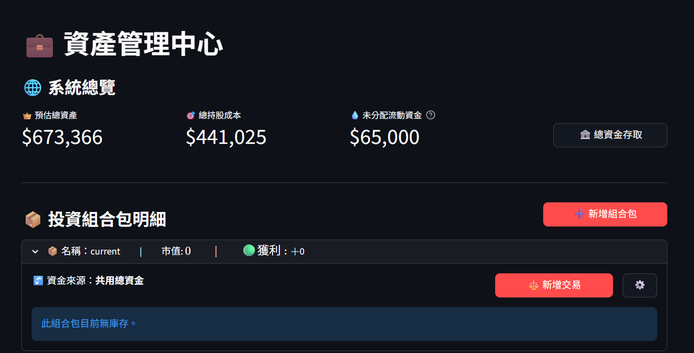
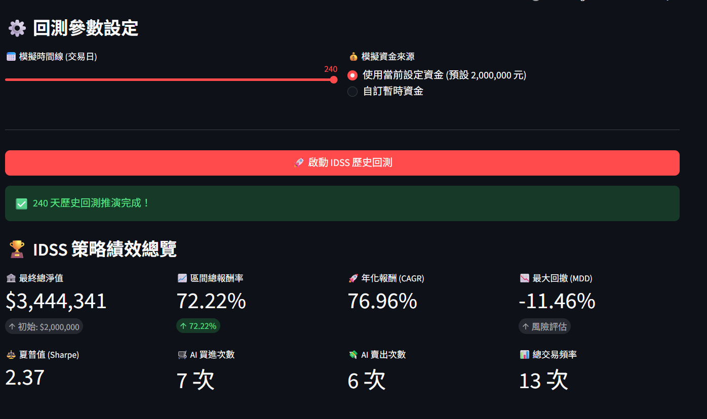
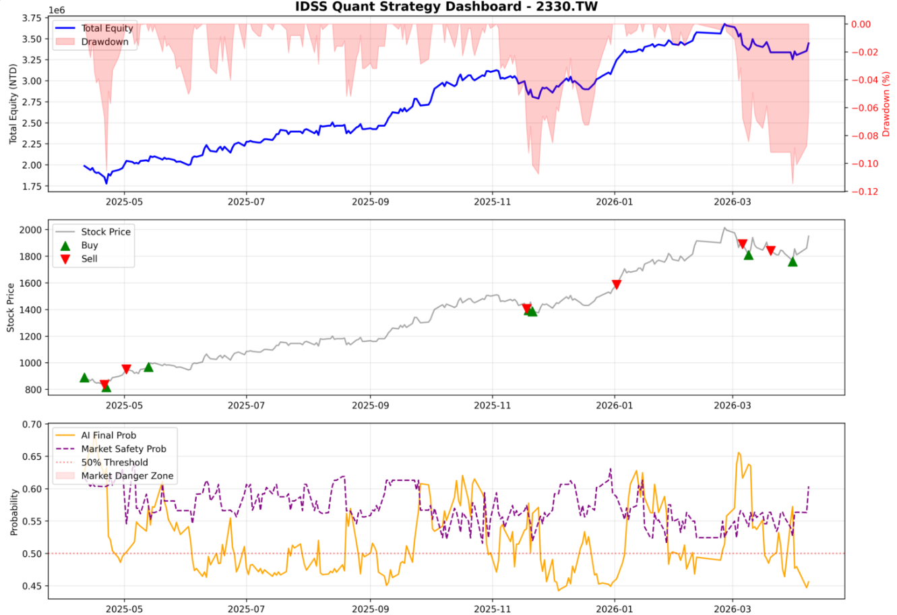
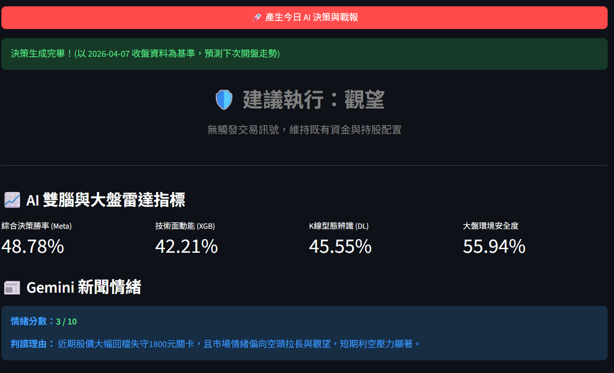
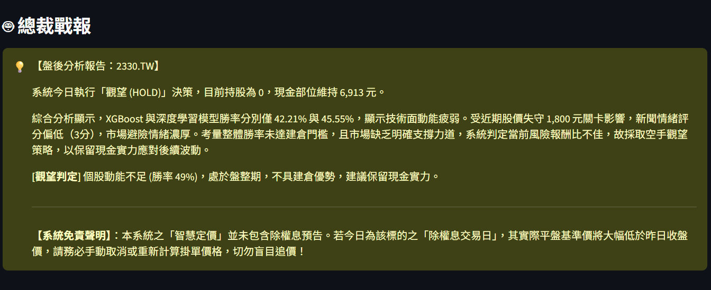
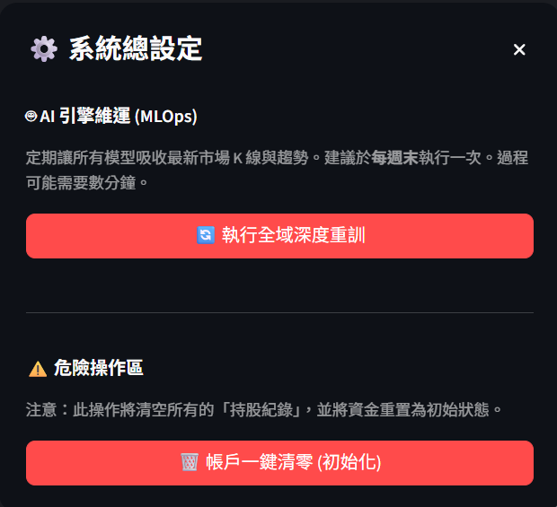

# IDSS 量化交易與決策支援系統 (Stock Market Analysis System)

**IDSS** 是一套專為台股與美股設計的**機構級多腦融合量化交易系統**。本專案屏棄了單一指標的盲點，首創「四腦協同運作」架構，完美融合 XGBoost、深度學習 (CNN-LSTM) 與巨觀環境分析 (Market Brain)，並透過 Meta-Learner 進行決策收斂。系統內建嚴密的資產風控模組與 LLM (Gemini) 戰報生成，提供從回測到即時推論的一站式完整體驗。

## 🌟 核心特色 (Key Features)

### 1. 🧠 核心預測大腦：四層決策融合架構
* **左腦 (XGBoost):** 專注於單日快照與非線性閾值探測，對極端值具備高抵抗力，是系統最穩定的基底動能探測器。
* **右腦 (Deep Learning):** 採用 CNN 降維提取特徵加上 LSTM/GRU 長期趨勢記憶，捕捉時序演進與歷史型態。
* **第三腦 (Market Regime):** 大盤防禦雷達，專注監控巨觀指數 (`^TWII`, `^SOX`)，預測系統性崩盤機率，擁有強制作空手的「一票否決權」。
* **總指揮 (Meta-Learner):** 接收雙腦在歷史 OOF 上的預測機率，客觀學習並計算出動態權重，融合成最終上漲勝率 ($P_{Final}$)。

### 2. 💼 機構級多投資組合與風控系統 (Multi-Portfolio & Risk Management)
**為什麼需要這個模組？** 「量化交易的長期獲利不僅取決於 AI 預測的勝率，更取決於資金的控管 (Position Sizing)。」傳統看盤軟體只給出「買/賣」訊號，卻無法得知使用者的口袋有多深，更無法有效隔離不同策略的資金。IDSS 內建了機構級的帳務管理系統，讓 AI 在下單前必須嚴格遵守您的預算紀律。
* **核心功能：**
    * **📦 獨立投資組合包 (Sub-Portfolios):** 支援建立多個獨立的投資組合（例如：AI 飆股策略、傳產避險池）。每個組合包擁有獨立的關注清單、庫存明細、未實現損益與專屬的歷史交易軌跡，讓策略成效一目了然。
    * **🚰 智慧資金雙軌制 (Smart Capital Routing):** 獨創「系統活資金 (大水庫)」與「專屬資金 (小水桶)」架構。您可以讓不同組合包「共用總資金」以極大化資金利用率，或是為特定策略「鎖定專屬資金」建立防火牆，徹底杜絕高價股吃光預算的「資金排擠效應」。
    * **🛡️ 智慧流動性風控:** 觸發買進訊號時，系統會同步檢查「該組合包目前的可用購買力」與該股的「5日平均成交量」。絕不給出超出帳戶餘額或市場流動性上限的危險買單。
    * **⚖️ 動態建議股數:** 透過行為樹演算法，精準算出本次交易的「建議買進股數」與「預估觸價」，並支援一鍵無縫帶入下單介面。

### 3. 🛡️ 高可用資料管線 (Robust Data Pipeline)
* **除權息平滑修復 (Backward Adjustment Watchdog):** 自動偵測不合理跳空缺口(如股票分割)。若源頭 API 資料損毀，將啟動「本地端強制向後復權」，完美縫合歷史特徵，防止 AI 將分割誤判為股災。
* **在地資料倉儲:** 基於 SQLite 構建，採用複合主鍵與 `INSERT OR REPLACE` 確保資料唯一性。
* **指數退避容錯:** 內建 API 重試機制與 HTTP 偽裝，有效防止高頻抓取時遭到 IP 封鎖。

### 4. 🌳 行為樹戰術決策中心 (Behavior Tree)
* 將 AI 輸出的勝率轉化為具備絕對紀律的動作指令 (`BUY`/`SELL`/`HOLD`)。系統會綜合預測數據與資金水位，執行最優化的交易決策。

### 5. 🤖 Gemini LLM 總裁戰報 (Sentiment Oracle)
* 結合 AI 勝率、技術型態與新聞情緒量化 (1-10 分)，生成具備投資邏輯的「盤後文字覆盤報告」，提供決策的白盒可解釋性。

## 🔬 深度學習模型超參數與架構實證 (Empirical Validation)

為了確保 IDSS 系統能在充滿雜訊的真實金融市場中穩定獲利，開發團隊針對核心的「右腦 (CNN-LSTM / GRU)」進行了深度的超參數優化實驗 (Hyperparameter Tuning)。

我們不僅追求理論上的「高預測準度 (AUC)」，更嚴格檢視其在實戰中的「獲利能力 (PnL)」與「抗回撤能力 (MDD)」。以下實驗結論展示了系統預設參數背後的科學依據：

### 📊 核心參數對決：理論完美 vs. 實戰王者

在實驗中，我們嘗試擴大神經網路容量 (`Hidden=64`) 並優化訓練效率 (`Batch=64, LR=0.001`)，並將其與系統預設的「黃金基準」進行殘酷對決：

| 模型架構與參數設定 | 預測準度 (DL_AUC) | 平均實戰報酬率 (Return) | 風險報酬比 (Sharpe) | 實驗評價 |
| :--- | :--- | :--- | :--- | :--- |
| 👑 **預設版 (LSTM, Hidden=32, Batch=32)** | **0.580** (極優) | **+5.92%** | **0.608** | **穩健王者。** 準度與獲利的完美平衡。 |
| 🚀 **預設版 (GRU, Hidden=32, Batch=32)** | **0.592** (最高) | +5.49% | 0.392 | **預測最準。** 攻擊性較強，波動略大。 |
| ❌ 擴充版 (LSTM, Hidden=64, Batch=64) | 0.573 (退步) | -0.43% (轉虧) | -0.268 | **陷入沉睡。** 過度保守，錯失大量交易機會。 |
| ❌ 輕量版 (LSTM, Hidden=16, Drop=0.35) | 0.544 (嚴重退步) | +2.24% (獲利腰斬)| 0.201 | **記憶喪失。** 容量不足以處理複雜型態。 |

### 🧠 實驗室三大核心發現 (Key Takeaways)

1. **Batch Size 32 的「抗噪奇效」 (Regularization by Noise)：**
   一般深度學習為了加速，常使用較大的 Batch Size (如 64 或 128)。但金融時間序列充滿極高的「雜訊」。實驗證明，較小的 Batch Size (`32`) 在更新梯度時會產生隨機震盪，這種震盪反而具備強大的「正則化 (Regularization)」效果，逼迫模型跳出局部最佳解，專注捕捉真實的波段動能。
2. **黃金腦容量：Hidden Size = 32：**
   當我們將 LSTM 隱藏層神經元降至 16 時，模型發生 Underfitting (欠擬合)；當強行擴充至 64 時，模型卻發生了 Over-parameterization (過度參數化)，開始死背歷史雜訊，導致不敢下單。**`32` 是處理 20 天 K 線滑動窗口最完美的記憶容量。**
3. **LSTM 與 GRU 的性格差異：**
   * **`Hybrid_LSTM` (預設主力)：** 具備完整的記憶閘門，性格沉穩挑剔。在台積電等大型權值股上表現卓越，回撤極小，是防禦力最高的選擇。
   * **`Hybrid_GRU`：** 結構精簡，性格兇猛。在面對長榮、華邦電等高波動股票時，擁有極強的爆發力。若使用者偏好高風險高報酬，可於原始碼中手動切換至此架構。

> 💡 **研發結論：** > 深度學習在量化金融的應用中，**「AUC (準確率) 最高，不代表賺最多」**。IDSS V2 出廠預設的 `DLHyperParams` (Batch=32, LR=0.002, LSTM_Hidden=32) 是經歷無數次 OOS (樣本外) 測試後，能在「抗噪、速度、獲利、風險」四個維度上取得最完美平衡的頂級參數組合。使用者無須重新調校，即可直接投入實戰。

### 💡 [研發日誌] 為什麼我們放棄了 Optuna 自動調參？(The Over-Optimization Trap)

在開發 IDSS V2 的過程中，我們曾導入業界標準的 **Optuna 貝氏最佳化框架**，讓 AI 自行在 50 個 Trial 中尋找最大化 `Mean AUC` 的超參數組合（包含動態調整 Channel、Hidden Size、Learning Rate 與 Dropout）。

**但實測結果卻給了我們震撼教育：自動調參找出的「數學最佳解」，在實戰中卻是「災難」。**

* **現象：** Optuna 找到了一組能在驗證集上達到極低 Loss 的參數（例如：較大的 Batch Size 配上極低的 Learning Rate），但在歷史回測中，該模型的總報酬率卻從原本的 +5.92% 暴跌至轉為虧損。
* **底層原因分析：**
  1. **金融市場的低信噪比 (Low Signal-to-Noise Ratio)：** 股票市場充滿了隨機漫步與假突破。Optuna 為了極大化 AUC，傾向於把神經網路訓練得「過度平滑」或是「過度擬合歷史雜訊」，導致模型在面對未知的未來時，變得極度保守而不敢下單。
  2. **指標的悖論 (AUC vs. PnL)：** 分類準確率極高，不代表能賺錢。有時為了抓住一個 +20% 的大波段（盈虧比高），我們必須容忍模型在盤整期犯下幾次小錯（降低 AUC）。Optuna 的目標函數無法完美捕捉「盈虧比」與「資金回撤」的動態關係。
* **我們的設計哲學：** 這場實驗讓我們深刻體認到，在量化交易中，**「領域知識 (Domain Intuition)」與「端到端財務回測 (End-to-End Financial Backtest)」** 的價值，遠大於純粹的機器學習自動優化。因此，我們最終摒棄了盲目的自動調參，選擇保留能帶來最高 Sharpe Ratio 與最低 MDD 的手工打磨參數。

## 📖 系統核心術語百科 (Terminology)

在開始使用 IDSS 之前，了解以下幾個核心名詞，能幫助您更好地掌握 AI 的思考邏輯：

* **🧠 戰術性格與風險等級 (Trading Persona & Risk Profile)**
  本系統專注於**波段交易 (Swing Trading)**，追求抱住一整段趨勢。AI 內部依據不同的風險承受度，具備三種決策性格供動態切換：
  * **🔥 激進型 (Aggressive)：** 追求最大資金利用率。買進門檻較低，停損區間較寬，願承受較大波動換取高潛在利潤。
  * **⚖️ 穩健型 (Moderate)：** 攻守兼備。資金控管嚴格，勝率要求適中，在利潤與風險之間取得最佳平衡。
  * **🛡️ 保守型 (Conservative)：** 防禦至上。極度挑剔進場點，遇大盤稍有風吹草動便提早減碼或空手。
* **🎯 智慧定價 (Smart Pricing)**
  AI 不會盲目使用「市價」追高殺低。觸發買賣訊號時，會根據近期「真實波動幅度 (ATR)」，動態計算出最容易成交且不吃虧的「限價單 (Limit Order) 建議價格」。
* **⏱️ OOS (Out-of-Sample) 樣本外防護**
  AI 訓練時最怕「作弊」。系統會強制把最近 $N$ 天的資料「遮住」不給 AI 看，只用更早的歷史來訓練，最後再用這 $N$ 天考試，確保預測能力在真實世界中依然有效。
* **🔄 向後復權 (Backward Adjustment)**
  當股票發生「除權息」或「分割」時，看門狗會自動將過去的歷史高價「按比例縮小」，讓整條 K 線平滑對齊，還原真實報酬軌跡。

## ⏳ IDSS 歷史回測系統：預見未來的時光機

### 【作用與目的】
回測系統是量化交易的靈魂。它的作用是回答一個核心問題：**「如果我過去 1 年都完全聽這套 AI 的指令交易，我現在會賺多少錢？」**
透過嚴謹的回測，我們能檢驗 AI 是否具備真實獲利能力，並確認系統是否有過度擬合 (Overfitting) 問題，從而建立絕對信心。

### 【運作機制】
1. **時光倒流：** 將大腦記憶推回過去，依據當今日期回推使用者決定的時間 (預設為 240 天交易日/約 1 年)。
2. **逐日推演：** AI 根據當時的「過去資料」生成勝率，並交由行為樹判斷是否買賣。
3. **資金模擬：** 內建「虛擬帳戶」，嚴格模擬每次買賣的扣款、手續費、滑價與剩餘資金。
4. **績效結算：** 走完歷史後，產出完整的健檢報告，展示策略在多空市場中的真實表現。

## 📊 策略績效總覽：如何判讀回測成績單？

### 📈 核心數值指標

* **年化報酬率 (Annualized Return)：** 假設把總獲利攤平到每一年，這套策略每年能賺多少 %。超過 15% 算優秀，25% 以上為頂尖。
* **最大回撤 (Max Drawdown, MDD)：** 衡量「痛苦指數」。帳戶資金從最高點滑落到最低點的「最大跌幅」。通常控制在 -20% 以內算穩健。
* **夏普值 (Sharpe Ratio)：** 「CP 值」。每承擔 1 單位風險能換取多少超額報酬。> 1.0 及格，> 1.5 優秀，> 2.0 為神級策略。
* **勝率與盈虧比 (Win Rate & P/L Ratio)：** 勝率不用追求 100%，只要「大賺小賠」（盈虧比高），即使勝率只有 40%，策略依然會長期暴利。

### 📉 三張關鍵圖表

在回測或歷史推演完成後，系統會產出四張關鍵的視覺化圖表，讓您徹底看透 AI 的決策邏輯：

1. **資金累積曲線圖 (Equity Curve)：** 展示帳戶總資金隨時間增長的軌跡。完美的曲線應「穩定向右上角攀升，無太深的向下凹洞」。
2. **K 線與買賣點標示圖 (Trade Markers)：** 標示出 AI 決定 🟢 買進與 🔴 賣出的精確位置。肉眼驗證 AI 是否做到「買在起漲點，賣在反轉前」。
3. **AI 勝率與大盤安全度走勢圖 (AI & Market Probability Chart)：** 系統的「決策大腦心電圖」，記錄 AI 對個股與大盤的信心變化軌跡：
   * **🟠 橘色實線 (綜合決策勝率)：** 該股最終上漲機率。突破 60% (0.60) 區間，通常為強烈買進訊號。
   * **🟣 紫色虛線 (大盤環境安全度)：** 大盤體檢分數。若跌入 **🟥 淺紅色底塊 (大盤危險區)**，代表系統性風險極高，強制啟動「防禦機制」擋下買單。
   * **🔴 紅色水平虛線 (多空分水嶺)：** 50% (0.50) 為絕對生死線，超過偏多，低於偏空。
   * **判讀技巧：** 「順風順水」(橘高紫高) 是最佳買點；「逆風飛行」(橘高紫低) 時系統會縮減資金或觀望；「扶不起的阿斗」(橘低紫高) 代表籌碼渙散，應果斷放棄。**（獲利靠橘線，保命靠紫線！）**

## ⚡ 今日行動指令：透視 AI 的決策大腦

當您點擊「預測今日走勢」時，系統會吐出四顆大腦的決策分數：

* **1. 綜合決策勝率 (Meta - 總指揮): `[核心決策依據]`**
  * **> 60%**：趨勢明確向上，強烈建議買進或加碼。
  * **45% ~ 55%**：多空不明，建議觀望 (HOLD)。
  * **< 40%**：下跌風險極高，建議賣出或停損。
* **2. 技術面動能 (XGB - 左腦):**
  * 專注 RSI、MACD、量價背離等。數值高 (> 50%) 代表目前籌碼面與技術指標處於易漲難跌結構。
* **3. K 線型態辨識 (DL - 右腦):**
  * 數值高 (> 50%) 代表最近 20 天的 K 線排列，與過去歷史中「準備飆漲前夕」高度相似。
* **4. 大盤環境安全度 (Market Brain - 第三腦):**
  * 保命符。數值高 (> 60%) 代表大盤處於大多頭；若數值**極低 (< 30%)** 代表即將崩盤，系統強制拒絕買進。
* **5. 新聞情緒分數 (Gemini Sentiment): `[例如：3 / 10]`**
  * **1~3 分：** 充滿恐慌或利空頻傳，進場風險高。
  * **4~6 分：** 消息面平淡，無明顯利多利空。
  * **7~10 分：** 釋出大利多或市場極度樂觀。

> 💡 **總結來說：** 一個完美的 **「強力買進 (Strong Buy)」** 訊號，通常會伴隨著：`XGB 與 DL 雙雙突破 60%` + `大盤安全度 > 50%` + `新聞情緒 >= 6`，最後由 Meta 總指揮拍板定案！

## 💻 系統介面 (User Interface)

本系統採用 **Streamlit** 開發現代化圖形介面，徹底實現前後端分離與高互動性：

* **視野快速對焦 K 線圖：** 針對歷史資料跨度較大時易產生的 Y 軸壓縮問題，內建快速對焦按鈕（近 1 個月、近 3 個月、近半年、近 1 年、全部）。一鍵切換觀察區間，圖表自動重新縮放至最高與最低點，確保波動細節清晰可見，拒絕失真壓縮。
* **非同步安全架構：** 所有耗時任務 (資料庫 I/O、模型推論) 皆進行異常捕捉與狀態列提示，確保介面流暢不卡頓。

## 🛠️ 最佳實務與維護建議 (Best Practices)

為確保 AI 模型能持續適應金融市場千變萬化的盤勢，強烈建議建立以下維護習慣：

### 🔄 定期「強制深度重訓」 (Weekly Retraining)
金融市場結構會隨時間改變 (Concept Drift)。
* **建議頻率：** **每週一次**（建議於週末休市期間進行）。
* **操作方式：**
  1. 開啟系統，進入側邊欄的 **「全系統重置與升級」** 分頁。
  2. 點擊 **「🔥 強制深度重訓 (Wipe & Train)」** 按鈕。
* **背後機制：** 系統將清空舊記憶、抓取本週最新資料，並讓三大腦重新學習最新市場微結構，產出最適應當下盤勢的權重。

## 🚀 啟動指引 (Quick Start)

本系統採用「免安裝綠色版 (Portable)」發布架構。請依照以下順序啟動：

1. **下載主程式：**
   前往本專案的 `[Releases]` 頁面，下載最新版本的專案壓縮檔，並解壓縮。
2. **部署 Python 運行環境：**
   前往 `[Releases]` 頁面下載對應的 **免安裝 Python 環境包**。解壓縮後，放置於專案「根目錄」下 (資料夾名稱應為 `python`)。
3. **輸入 Gemini Key：**
   請至資料夾位置 **`SMAS\data\raw`**，將下載好的 **`key.env`** 放入此處。打開該檔案輸入您的 Gemini API Key (可輸入多組以保證穩定)。
4. **檢查啟動捷徑：**
   開啟專案根目錄，檢查是否有 **`SMAS_量化系統.lnk`** 捷徑。
5. **系統環境初始化 (若無捷徑)：**
   若無捷徑或是初次執行，請雙擊執行目錄中的腳本：
   👉 **`初次執行請點擊我.vbs`**
   *(此腳本將自動掃描環境路徑，綁定 Python 執行檔，並生成啟動捷徑)*
6. **啟動系統：**
   雙擊 **`SMAS_量化系統`** 捷徑，無痕啟動背景 AI 引擎與操作介面。

> 💡 **首次使用提示：**
> 進入系統後，請先至側邊欄輸入欲追蹤的股票代號。進入「全系統重置與升級」分頁點擊 **「強制深度重訓 (Wipe & Train)」** 完成四大 AI 模型訓練，即可開始量化推論。

## ⚠️ 免責聲明 (Disclaimer)

本專案 (`IDSS-Quant`) 僅供學術研究、量化模型開發與程式設計交流之用。系統產出的任何預測勝率、買賣訊號、建議股數、智慧定價或戰報內容，**皆不構成任何形式的投資建議**。金融市場具備高度不確定性，使用者應自行評估風險，並對實際交易之盈虧負完全責任。